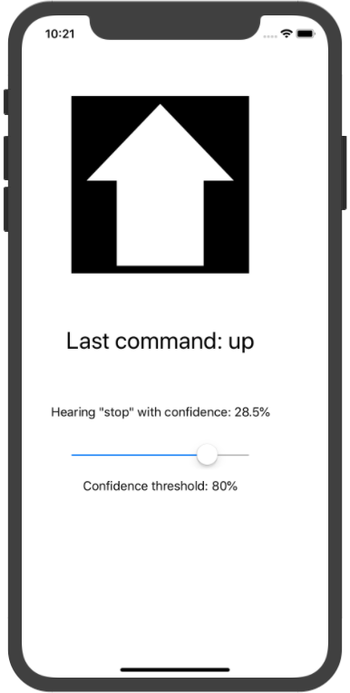

# CoreML Custom Speech Recognition Tutorial

This tutorial will walk you through the steps to integrate a custom CoreML speech recognition model into an iOS app and have it process input from the microphone.

## Table of Contents
1. [The Speech Model](#the-speech-model)
2. [Converting to CoreML](#converting-to-coreml)
3. [Accessing the Model](#accessing-the-model)
4. [Getting Audio Data](#getting-audio-data)
5. [Performing Classification](#performing-classification)
6. [Results](#results)

## The Speech Model

The speech recognition model we will be using is a simple 1-dimensional convolutional neural network.
It will take in a second worth of audio input at 16 kHz and classify it as one of 12 different categories. [See the main page for a list of categories.](index)

The data used to train this model is from the Tensorflow Speech Commands Dataset. This dataset was recently featured in a kaggle competition (<https://www.kaggle.com/c/tensorflow-speech-recognition-challenge>) and our model roughly follows the parameters of that challenge. 

The training data consists of 1-second clips of various people saying the command. The format of the clips is in 16kHz, 16-bit mono wave file files. This means that for each clip, we load 16000 audio samples as a list of 16-bit integers. To make training a bit easier for our network, we'll normalize the input to a range of -1 to 1 by dividing the samples by 2^15. This is the only preprocessing we'll do and, depending on the audio format used by the microphone, may or may not be required in our iOS app.

`samples = samples / (2**15)`

Our network is defined as follows:

```python
input_shape = (16000,)

model = keras.models.Sequential()

model.add(keras.layers.Reshape((16000,1), input_shape=input_shape))
model.add(keras.layers.Conv1D(2, kernel_size=4, strides=2, activation='relu', padding='valid'))
model.add(keras.layers.Conv1D(4, kernel_size=4, strides=2, activation='relu', padding='valid'))
model.add(keras.layers.Conv1D(8, kernel_size=4, strides=2, activation='relu', padding='valid'))
model.add(keras.layers.Conv1D(16, kernel_size=4, strides=2, activation='relu', padding='valid'))
model.add(keras.layers.Conv1D(32, kernel_size=4, strides=2, activation='relu', padding='valid'))
model.add(keras.layers.Conv1D(64, kernel_size=4, strides=2, activation='relu', padding='valid'))

model.add(keras.layers.Flatten())
model.add(keras.layers.Dense(300, activation='relu'))
model.add(keras.layers.Dense(150, activation='relu'))
model.add(keras.layers.Dense(len(labelNames), activation='softmax'))

#Compile model with loss and optimizer functions
model.compile(loss=keras.losses.categorical_crossentropy,
              optimizer=keras.optimizers.Adam(),
              metrics=['accuracy'])

model.summary()
```

This architecture was chosen pretty arbitrarily, and you should try to experiment and find a better one if you're so inclined. After training, the model is about 60% accurate on the data we set aside for validation. That's pretty abyssmal for any real applications, but it's okay for our demonstration purposes. For reference, the winner of the kaggle challenge achieved around 91% accuracy.

Note the Reshape layer right at the beginning. CoreML only supports 1, 3, or 5 dimensions for input, but our convolutional network needs a second dimension for the convolution filters. The Reshape layer adds that second dimension to the 1-dimensional audio input.

## Converting to CoreML

There are a few key things to keep in mind when converting a Keras model to CoreML:
- Keras must be version 1.2.2+
- The model must be defined using layers from the standalone keras module. Using the tensorflow.keras module will confuse the converter.
- CoreML only supports input of 1, 3 or 5 dimensions. If your model needs a different format, you must include a Reshape layer to transform it into that format.
- Not all Keras layers are supported by Apple's converter. If your model features more advanced layers, you can look into writing a [custom conversion tool](https://developer.apple.com/documentation/coreml/converting_trained_models_to_core_ml) or adding them as [custom layers](https://developer.apple.com/documentation/coreml/core_ml_api/creating_a_custom_layer)

Our model is simple enough that it can be converted using the converter that Apple provides through the coremltools module. We just need to import it and run the keras converter on our model.

```python
import coremltools

coreMLModel = coremltools.converters.keras.convert(
    model,
    class_labels = labelNames)
```

The optional class_labels parameter adds the human-readable name of each command class so we don't need to worry about the specific order of the output.

The converter will display the layers as they are added to the CoreML model. To make sure the input and output has been properly formatted, we can check coreMLModel.get_spec, which will output something like this:
```
<bound method MLModel.get_spec of input {
  name: "input1"
  type {
    multiArrayType {
      shape: 16000
      dataType: DOUBLE
    }
  }
}
output {
  name: "output1"
  type {
    dictionaryType {
      stringKeyType {
      }
    }
  }
}
output {
  name: "classLabel"
  type {
    stringType {
    }
  }
}
predictedFeatureName: "classLabel"
predictedProbabilitiesName: "output1"
>
```
As we can see, the input has the proper shape and the output will include the name of the most probable class and a dictionary containing the full set of softmax probabilities for each class. If we wanted to optimize the model's size, we could reduce the input precision from double to float, but it's not too important.

Finally, we save the model in a .mlmodel file which can be accessed inside the app.
```python
coreMLModel.save('FlatSpeech.mlmodel')
```

## Accessing the Model

Once the CoreML model has been saved, create a single-view iOS app and add the model to the project files.

For easy access to the model from inside the app, we'll add a class that will wrap its classification function. XCode will automatically generate a class for the model, so to access we just need to import CoreML and instantiate that class.

```swift
import CoreML

class FlatSpeechModelWrapper {

    let model = FlatSpeech()
}
```

To perform classification, the model needs to be provided with a MLMultiArray containing the input data. In this case, the 16000 normalized audio samples. Our Classify wrapper function will take an AudioQueue, which is a class we've created to contain the buffered audio data in integer form. We normalize each sample stored in the queue and add it to a MLMultiArray. We construct a FlatSpeechInput object out of that and ask the model to make a prediction based on that input.

```swift
func Classify(audioQueue : AudioQueue) throws -> FlatSpeechOutput {
    let audio = audioQueue.data
    let audioArray = try MLMultiArray(shape: [16000], dataType: .double)

    for i in 1..<16000{
        var sample = Double(audio![i])
        sample = sample / pow(2, 15) // Normalize
        audioArray[i] = NSNumber(value: sample)
    }
    let input = FlatSpeechInput(input1: audioArray)
    let output = try model.prediction(input: input)

    return output
}
```

The return value from the classify function is a FlatSpeechOutput object, which contains the label of the predicted command and the softmax probabilities of each command.

## Getting Audio Data

To start on the app's main functionality, we'll import AVFoundation and Foundation in the ViewController and declare some important variables

```swift
import AVFoundation
import Foundation

class ViewController: UIViewController {
    
    @IBOutlet weak var commandLabel: UILabel!
    @IBOutlet weak var commandImageView: UIImageView!
    @IBOutlet weak var currentClassLabel: UILabel!
    @IBOutlet weak var confidenceSlider: UISlider!
    @IBOutlet weak var confidenceLabel: UILabel!
    
    var recordingSession:AVAudioSession!
    var updateTimer: Timer?
    var engine = AVAudioEngine()
    
    //Time in seconds between each attempt to identify a command
    let updatePeriod = 0.1
    
    //Required confidence before an action is triggered by a speech command
    var confidenceThreshold = 0.8
    
    let model = FlatSpeechModelWrapper()

    //Queue stores buffered audio
    var audioQueue = AudioQueue(size: 16000, blockSize: 1600)
```

The most important elements here are the AVAudioSession and the AVAudioEngine. These are what we'll use to access the microphone's input.

We'll use a function to start accessing the raw microphone input. First we'll reset the audio engine if needed, then configure an audio session with the format we need and request access to the microphone.

```swift
func startRecording() {
        engine.stop()
        engine.reset()
        engine = AVAudioEngine()
        
        recordingSession = AVAudioSession.sharedInstance()
            
        do {
            //Configure and activate the recording session
            try recordingSession.setPreferredSampleRate(16000.0)
            try recordingSession.setPreferredInputNumberOfChannels(1)
            try recordingSession.setCategory(.record, mode: .default)
            try recordingSession.setMode(.measurement)
            try recordingSession.setPreferredIOBufferDuration(0.1)
            try recordingSession.setActive(true)
            
            //Request mic access
            recordingSession.requestRecordPermission() { [unowned self] allowed in
                DispatchQueue.main.async {
                    if allowed {
                        print("Gained microphone permission.")
                    } else {
                        print("Microphone permission was denied.")
                    }
                }
            }

        } catch {
            
            assertionFailure("AVAudioSession setup error: \(error)")
        }
```

In order to get the mic input in a useable format, we need a mixer node that will downsample the input audio. We'll make one and attach it to the engine.

```swift
let downmixer = AVAudioMixerNode()
engine.attach(downmixer)
```

Since we want to access the output of the downmixer, we install a tap on it that will provide the audio buffer. Since the session's preferred buffer duration is a tenth of a second, we'll set the tap's buffer size to 1600 samples. The tap will provide the buffered audio to a function which we'll define later.

```swift
downmixer.installTap(onBus: 0, bufferSize: 1600, format: downmixer.outputFormat(forBus: 0)) { (buffer, time) in
    self.handleAudioInput(buffer: buffer, time: time)
}
```

Next, we'll define the format that we want the downmixer to output as. Unfortunately, there's a small problem here. The audio engine only supports three standard sample rates: 11025, 22050 and 44100. 11025 will work with our setup, but as a consequence the classifier will perceive the audio as about 50% faster than it actually is. To fix this, we would need to use a higher sample rate and manually downsample it to 16kHz. 

For now, we can just work around it by talking slowly 👍

```swift
let format16KHzMono = AVAudioFormat(commonFormat: AVAudioCommonFormat.pcmFormatInt16, sampleRate: 11025.0, channels: 1, interleaved: true)
```

Next, we connect the downmixer into the audio pipeline. The input will flow into the downmixer, which will send its output to the main mixer node. We mute the main mixer node so it doesn't repeat everything the mic gets into the output. Notice that the audio format we defined earlier is applied to the connection between the downmixer and main mixer.

```swift
let input = engine.inputNode
let inputFormat = input.inputFormat(forBus: 0)

engine.connect(input, to: downmixer, format: inputFormat)
engine.connect(downmixer, to: engine.mainMixerNode, format: format16KHzMono)

//Prevent audio from being sent to the output
engine.mainMixerNode.outputVolume = 0
```

Finally, we prepare the audio engine and try to start it.

```swift
engine.prepare()
try! engine.start()
```

Remember the function we call from the downmixer's tap? We'll define it now.

```swift
 func handleAudioInput(buffer: AVAudioPCMBuffer, time: AVAudioTime){
        if (buffer.int16ChannelData != nil && buffer.frameLength == 1600){
            audioQueue.enqueueBlock(block: buffer.int16ChannelData!.pointee)
        }
        else{
            print("Error: Buffer not filled.")
            print(buffer.frameLength)
            print(buffer.int16ChannelData)
        }
    }
```

When the function receives a properly filled audio buffer, it adds it to the audio queue. 

So why not just buffer a full second of audio and perform classification here? Well, the tap block is called whenever its buffer is filled. What if the user starts saying something at the end of one buffer and ends at the beginning of another? We want a smooth sliding window of audio to handle such cases, which is what the audio queue allows. We'll go over setting up the actual classification in the next section.

## Performing Classification

We'll define a function that will take the data stored in the audio queue and pass it to the model. 

```swift
//Attempt to classify the currently buffered audio
func classifyAudio(){
    do{
        let output = try model.Classify(audioQueue: audioQueue)

        let confidence = (output.output1[output.classLabel] ?? 0)
        print(String(format: "Hearing: \(output.classLabel) with confidence: %.4f", confidence))
        currentClassLabel.text = String(format: "Hearing \"\(output.classLabel)\" with confidence: %.1f%%", confidence * 100)

        //Do something with the classification...

    }
    catch let err{
        print(err)
    }
}
```

Here we get the classification of the currently queued audio. Next, we'll check if it is a valid command and if the classification confidence meets the threshold. If it does, we'll display the command.

```swift
if (confidence >= confidenceThreshold && output.classLabel != "silence" && output.classLabel != "unknown"){
    commandLabel.text = "Last command: \(output.classLabel)"

    //Take an action based on the command (in this case, show an image)
    switch (output.classLabel){
    case "yes":
        commandImageView.image = UIImage(named: "thumb-up")
        break
    case "no":
        commandImageView.image = UIImage(named: "thumb-down")
        break
    case "up":
        commandImageView.image = UIImage(named: "plain-arrow-up")
        break
    case "down":
        commandImageView.image = UIImage(named: "plain-arrow-down")
        break
    case "left":
        commandImageView.image = UIImage(named: "plain-arrow-left")
        break
    case "right":
        commandImageView.image = UIImage(named: "plain-arrow-right")
        break
    case "on":
        commandImageView.image = UIImage(named: "light-bulb-on")
        break
    case "off":
        commandImageView.image = UIImage(named: "light-bulb-off")
        break
    case "stop":
        commandImageView.image = UIImage(named: "traffic-lights-red")
        break
    case "go":
        commandImageView.image = UIImage(named: "traffic-lights-green")
        break
    default:
        print("Unexpected classification: \(output.classLabel)")
        break
    }
}
```

So we have our classification function, now we need to trigger it somehow. We'll make a timer that calls it based on the interval we defined earlier.

```swift
//Register a timer for classifying the Audio
func startClassification(){
    guard updateTimer == nil else {return}
    self.updateTimer = Timer(timeInterval: self.updatePeriod, repeats: true, block: { (timer) in
        self.classifyAudio()
    })
    RunLoop.current.add(updateTimer!, forMode: .default)
}
```

This function will setup a timer that will call the classifyAudio function every updatePeriod (0.1 seconds based on the declaration earlier.)

Finally, we need to call both setup functions from viewDidLoad.

```swift
override func viewDidLoad() {
    super.viewDidLoad()
    // Do any additional setup after loading the view, typically from a nib.
    startRecording()
    startClassification()
}
```

## Results

So what have we made after all of this? Well, the classifier is quite inaccurate as mentioned previously, and it's not helped by our less-than optimal way of accessing the mic audio. Despite this, it is able to recognize spoken commands and display an image related to them.



The most significant issues are as follows:
1. The speech recognition model is very inaccurate, with only about a 60% validation accuracy.
2. Some classes, such as "up", are predicted with a much higher confidence than they should be. This could be a problem with the model or the training data.
3. The input audio isn't properly downsampled to 16kHz. Since that sample rate isn't supported, the input must either be manually downsampled or the model must be trained with training data in a supported format.
4. As the audio queue slides its window across the input, the classification will change. This means that, for example, if the user says "stop", while it will be fairly reliably be identified, as the audio window moves away from the centre of the word, it will start classifying the "-op" sound as "up". While increasing the conidence threshold helps with this, it makes accurate classification harder and issue #2 means it isn't a reliable solution. Some possible solutions are:

- Try to identify the start and end of a word and only classify within that range.
- Pause classification and allow the queue to clear once the classifier is sufficiently confident with its result.
